# 🚀 Agentic Graph RAG as a Service
## *Powered by Lyzr.AI*

A comprehensive AI platform for building intelligent knowledge graphs using Retrieval-Augmented Generation (RAG) with agentic capabilities, advanced OCR processing, and multi-LLM support. Transform your documents into interactive, queryable knowledge systems with cutting-edge AI-powered processing and beautiful visualizations.


## 🎯 Overview

The Agentic Graph RAG platform revolutionizes document processing by combining cutting-edge AI technologies to create intelligent, queryable knowledge systems. Our platform seamlessly integrates advanced OCR processing, multi-LLM support, and interactive graph construction to transform your documents into actionable insights with beautiful animated visualizations.

### 🌟 **What Makes This Special**
- **Beautiful UI**: Premium dark theme with animated gradients and particle effects
- **Smart OCR Pipeline**: Upload → OCR → Text → Module Processing → Knowledge Graph
- **Real-time Status**: Green/red indicators show module readiness and data flow
- **Interactive Visualizations**: Animated relationship graphs with arrows and symbols
- **Document-Driven**: All features work based on your uploaded documents
- **Powered by Lyzr.AI**: Enterprise-grade AI platform with professional support

## ✨ Key Features

### 🤖 **Dual LLM Support**
- **Grok Integration**: X.AI's powerful Grok model for advanced reasoning
- **Gemini Integration**: Google's Gemini Pro for comprehensive language understanding
- **Dynamic Switching**: Seamlessly switch between LLMs based on task requirements
- **API Key Management**: Secure configuration for both models

### 📄 **Advanced OCR Processing**
- **Smart Document Detection**: Automatic file type detection and routing
- **PDF OCR**: High-quality text extraction from scanned PDFs using Tesseract
- **Image OCR**: Extract text from JPG, PNG, BMP, TIFF, GIF formats
- **Multi-page Support**: Process entire PDF documents page by page
- **Quality Enhancement**: 300 DPI processing for optimal text recognition
- **Local Storage**: Extracted text stored locally for fast access
- **Real-time Progress**: Live OCR progress with visual feedback

### 🔄 **Smart Document Processing Pipeline**
- **Beautiful Upload Interface**: Drag-and-drop with animated progress bars
- **OCR-First Processing**: Files → OCR → Text → Module Distribution
- **Module Status Indicators**: Green dots when modules receive data
- **Real-time Updates**: Live progress with Server-Sent Events (SSE)
- **Local Text Storage**: OCR results saved as text files locally
- **Batch Processing**: Handle multiple documents simultaneously
- **Error Recovery**: Robust error handling with detailed feedback

### 🧠 **AI-Powered Ontology Generation**
- **LLM + OCR Integration**: Process OCR text with advanced prompting
- **Entity Extraction**: Identify people, organizations, locations, concepts
- **Relationship Discovery**: Find connections between entities with confidence scores
- **Hierarchical Structure**: Organized entity types with detailed attributes
- **Local Storage**: Ontology results saved as structured text files
- **Interactive Results**: Explore entities and relationships with animations

### 🔍 **Entity Resolution & Deduplication**
- **Fuzzy Matching**: Advanced algorithms for entity deduplication
- **Semantic Similarity**: Vector-based similarity scoring
- **Confidence Metrics**: Detailed confidence scores for matches
- **Batch Processing**: Efficient handling of large entity sets

### 🗄️ **Multi-Database Integration**
- **Neo4j Graph Database**: Store and query knowledge graphs
- **ChromaDB Vector Store**: Semantic search and embeddings
- **SQLite Mapping**: Canonical storage mapping between databases
- **Real-time Sync**: Automatic synchronization across systems

### 🎨 **Beautiful Premium Interface**
- **Stunning Header**: Project branding with "Powered by Lyzr.AI"
- **Dark Theme**: Professional dark mode with animated gradients
- **Particle Effects**: Floating particles and animated backgrounds
- **Module Status**: Real-time green/red dots showing data readiness
- **Animated Visualizations**: Interactive graphs with arrows and symbols
- **Responsive Design**: Mobile-first layout with touch support
- **File Management**: Drag-and-drop upload with progress tracking

### 📊 **Comprehensive Logging & Monitoring**
- **Pipeline Tracking**: Complete process logging from upload to completion
- **Performance Metrics**: Processing time and success rate monitoring
- **Error Tracking**: Detailed error logs with stack traces
- **System Health**: Real-time monitoring of all components

## 🏗️ Architecture

### **14 Core Modules**

1. **📤 Document Upload** - Multi-format file processing with OCR
2. **🧠 Ontology Generator** - AI-powered entity and relationship extraction
3. **🔍 Entity Resolution** - Advanced deduplication and matching
4. **📊 Embedding Generator** - Vector embeddings with ChromaDB
5. **🌐 Graph Constructor** - Neo4j knowledge graph building
6. **🔗 Knowledge Graph** - Interactive D3.js visualization
7. **🤖 Agentic Retrieval** - Multi-strategy information retrieval
8. **💭 Reasoning Stream** - Conversational AI with reasoning chains
9. **💬 AI Chatbot** - Interactive query interface
10. **📋 File Processing Tracker** - Real-time processing monitoring
11. **🖥️ Live Query Console** - Direct database query interface
12. **💬 Static Chatbox** - Simple chat interface
13. **👥 Group Management AI** - Multi-user collaboration
14. **📖 Documentation** - Comprehensive system documentation

## 🔄 Enhanced Processing Workflow

```mermaid
graph TD
    A[📤 Beautiful File Upload] --> B{🔍 Smart File Detection}
    B -->|PDF| C[📄 OCR PDF Processing]
    B -->|Image| D[🖼️ OCR Image Processing]
    B -->|Text| E[📝 Direct Text Processing]
    
    C --> F[💾 Local Text Storage]
    D --> F
    E --> F
    
    F --> G[🔄 Module Data Distribution]
    G --> H[🟢 Module Status: Green]
    
    H --> I[🧠 LLM + OCR Ontology Generation]
    H --> J[🔍 Entity Resolution & Deduplication]
    H --> K[📊 Vector Embedding Generation]
    H --> L[🌐 Neo4j Graph Construction]
    
    I --> M[💾 Ontology Text Files]
    J --> N[🗄️ Neo4j Graph Database]
    K --> O[🔍 ChromaDB Vector Store]
    L --> N
    
    N --> P[🎨 Animated Graph Visualization]
    O --> Q[🔍 Semantic Search Interface]
    
    P --> R[💬 Interactive AI Chatbot]
    Q --> R
    
    R --> S[🎯 Document-Based Responses]
```



## 🚀 Quick Start

### Prerequisites

- Python 3.9+
- Node.js 16+
- Neo4j 5.x
- Tesseract OCR (for document processing)
- Git

### Installation

1. **Clone the repository**
```bash
git clone https://github.com/lyzr-ai/agentic-graph-rag-as-a-service.git
cd agentic-graph-rag-as-a-service
```

2. **Backend Setup**
```bash
cd backend
pip install -r requirements.txt

# Set environment variables
export GROK_API_KEY="your_grok_api_key"
export GEMINI_API_KEY="your_gemini_api_key"
export NEO4J_URI="bolt://localhost:7687"
export NEO4J_USER="neo4j"
export NEO4J_PASSWORD="your_password"
```

3. **Frontend Setup**
```bash
cd frontend
npm install
```

4. **Start the Application**
```bash
# Backend (with system checks)
cd backend
python start_server.py

# Frontend
cd frontend
npm start
```

## 📋 System Requirements Check

The platform includes comprehensive system validation:

```bash
🔍 Checking System Requirements...
📋 System Check Results:
Python: 3.9.7 ✅
📦 Package Status:
  fastapi: 0.104.1 ✅
  neo4j: 5.14.1 ✅
  chromadb: 0.4.18 ✅
  pytesseract: 0.3.10 ✅
🔧 Service Status:
  LLM: Hello AI! Bot is working ✅
  Embeddings: Embedding AI is working ✅
  Neo4j: Neo4j connection successful ✅
```

## 🔧 Configuration

### LLM Configuration

```python
# backend/config/llm_config.py
from config.llm_config import llm_config

# Set API keys
llm_config.set_api_keys(
    grok_key="your_grok_api_key",
    gemini_key="your_gemini_api_key"
)

# Switch between models
llm_config.switch_llm("grok")  # or "gemini"
```

### OCR Configuration

```python
# For Windows users, set Tesseract path
pytesseract.pytesseract.tesseract_cmd = r"C:\Program Files\Tesseract-OCR\tesseract.exe"
```

## 📊 Features in Detail

### 📋 Enhanced File Processing Pipeline

1. **📤 Beautiful Upload**: Drag & drop interface with animations
2. **🔍 Smart Detection**: Automatic file type detection and routing
3. **📄 Advanced OCR Processing**: 
   - **PDFs**: Page-by-page text extraction with Tesseract
   - **Images**: High-quality OCR with image preprocessing
   - **Text files**: Direct content reading and validation
4. **💾 Local Storage**: OCR results saved as text files locally
5. **🔄 Module Distribution**: Extracted text sent to all 14 modules
6. **🟢 Status Indicators**: Real-time green/red dots show module readiness
7. **🎯 Ready for Processing**: Modules turn green when data is available

### Module Status System

- **🟢 Green Dot**: Data successfully distributed to module
- **🔴 Red Dot**: No data available for module
- **⏳ Processing**: Module currently processing data
- **✅ Complete**: Module finished processing

### Real-time Logging

All operations are logged with timestamps:

```
2024-10-15 00:14:23 - INFO - 🚀 PIPELINE START: File Processing | File: document.pdf
2024-10-15 00:14:24 - INFO - ⏳ PIPELINE PROGRESS: OCR PDF Processing | Processing page 1/5
2024-10-15 00:14:28 - INFO - ✅ PIPELINE SUCCESS: OCR PDF Processing | Extracted 2,847 characters
2024-10-15 00:14:29 - INFO - ✅ PIPELINE SUCCESS: Data Distribution | Data sent to ontology
```

## 🎨 User Interface

### Premium Design Features

- **Glassmorphism Effects**: Translucent panels with backdrop blur
- **Neon Accents**: Blue/cyan hover effects and glowing elements
- **Particle Systems**: Animated background particles and grid patterns
- **Smooth Animations**: Framer Motion transitions throughout
- **Responsive Layout**: Mobile-first design with touch support

### Module-Specific Themes

- **Ontology Generator**: Blue theme with grid particles
- **Graph Constructor**: Emerald theme with network nodes
- **Entity Resolution**: Purple theme with connection lines
- **Each module**: Unique color scheme and animations

## 🔍 API Documentation

### Core Endpoints

```bash
# File Upload with OCR
POST /upload-with-ocr
Content-Type: multipart/form-data

# Ontology Generation
POST /ontology/generate
{
  "text": "extracted_text",
  "llm_model": "grok"
}

# Entity Resolution
POST /entity-resolution/detect-duplicates
{
  "entities": [...],
  "threshold": 0.8
}

# Graph Construction
POST /graph/build-from-ontology
{
  "ontology_data": {...}
}
```

## 🧪 Testing

```bash
# Run backend tests
cd backend
python -m pytest tests/

# Run frontend tests
cd frontend
npm test
```

## 📝 Logging

Logs are stored in `backend/logs/` with daily rotation:

- **File Logs**: Detailed logs with function names and line numbers
- **Console Logs**: Real-time status updates
- **Pipeline Tracking**: Complete workflow monitoring
- **Error Tracking**: Comprehensive error logging

## 🤝 Contributing

1. Fork the repository
2. Create a feature branch
3. Make your changes
4. Add tests
5. Submit a pull request

## 📄 License

MIT License - see LICENSE file for details

## 🆘 Support

- **Documentation**: [docs.lyzr.ai](https://docs.lyzr.ai)
- **Issues**: GitHub Issues
- **Email**: support@lyzr.ai
- **Discord**: [Lyzr Community](https://discord.gg/lyzr)

## 🙏 Acknowledgments

- **Lyzr.AI Team**: Core development and architecture
- **Open Source Libraries**: FastAPI, React, Neo4j, ChromaDB
- **AI Models**: Grok (X.AI), Gemini (Google)
- **OCR**: Tesseract OCR Engine

---

**Built with ❤️ by Lyzr.AI**

### 🔍 **Entity Resolution & Deduplication**
- **Fuzzy Matching**: Token-sort ratio and Jaro-Winkler algorithms
- **Semantic Similarity**: Embedding-based entity matching
- **Confidence Scoring**: Merge confidence with manual review options
- **Batch Processing**: Handle large entity sets efficiently

### 📊 **Vector Embeddings & Semantic Search**
- **Multi-model Support**: Sentence-transformers and custom models
- **ChromaDB Integration**: Efficient vector storage and retrieval
- **Semantic Search**: Natural language queries with relevance scoring
- **3D Visualization**: Interactive vector space exploration

### 🌐 **Interactive Knowledge Graph**
- **Neo4j-like Interface**: Smooth, draggable, zoomable graph visualization
- **Real-time Updates**: Live synchronization with database changes
- **Entity Clustering**: Semantic grouping of related entities
- **Relationship Mapping**: Visual representation of entity connections

### 🤖 **RAG Chatbot & Reasoning**
- **Intelligent Queries**: Natural language interaction with knowledge base
- **Source Attribution**: Traceable answers with document references
- **Reasoning Chains**: Step-by-step thought processes
- **Context Memory**: Conversation history and context awareness

### 🎯 **Advanced Filtering & Search**
- **Logical Filters**: Complex AND/OR/NOT operations
- **Attribute Filtering**: Filter by entity types, confidence, relationships
- **Graph Traversal**: Similarity-based path finding
- **Natural Language**: Convert text queries to structured filters

## 🏗️ Architecture

```
┌─────────────────┐    ┌─────────────────┐    ┌─────────────────┐
│   React Frontend │    │  FastAPI Backend │    │   AI Services   │
│                 │    │                 │    │                 │
│ • Interactive UI │◄──►│ • REST APIs     │◄──►│ • Google Gemini │
│ • Real-time SSE │    │ • WebSockets    │    │ • Embeddings    │
│ • 3D Viz        │    │ • Background    │    │ • NLP Pipeline  │
└─────────────────┘    │   Jobs          │    └─────────────────┘
                       └─────────────────┘
                              │
                    ┌─────────┴─────────┐
                    │                   │
            ┌───────▼────────┐  ┌──────▼──────┐
            │     Neo4j      │  │  ChromaDB   │
            │                │  │             │
            │ • Entities     │  │ • Vectors   │
            │ • Relations    │  │ • Chunks    │
            │ • Graph Ops    │  │ • Search    │
            └────────────────┘  └─────────────┘
```

## 🚀 Quick Start

### Prerequisites
- Python 3.8+
- Node.js 16+
- Neo4j Database
- Git

### 1. Clone Repository
```bash
git clone https://github.com/bharathmrr/agentic-graph-rag-as-a-service.git
cd agentic-graph-rag-as-a-service
```

### 2. Backend Setup
```bash
# Install Python dependencies
pip install -r requirements.txt

# Set up environment variables
cp .env.example .env
# Edit .env with your API keys and database URLs

# Start Neo4j (if using Docker)
docker run -p 7474:7474 -p 7687:7687 -e NEO4J_AUTH=neo4j/password123 neo4j:latest

# Start the backend server
python run_server.py
```

### 3. Frontend Setup
```bash
cd frontend
npm install
npm run dev
```

### 4. Access the Application
- **Frontend**: http://localhost:3000
- **Backend API**: http://localhost:8000
- **API Docs**: http://localhost:8000/docs
- **Neo4j Browser**: http://localhost:7474

## 📋 API Documentation

### Standard Response Format
All endpoints return a consistent response structure:

```json
{
  "success": true,
  "status_code": 200,
  "processing_ms": 1250,
  "data": { /* endpoint-specific data */ },
  "warnings": [],
  "error": null
}
```

### Core Endpoints

#### 📤 **Document Upload**
```http
POST /upload
Content-Type: multipart/form-data

Response:
{
  "data": {
    "doc_id": "uuid",
    "file_name": "document.pdf",
    "source": "upload",
    "char_count": 15000,
    "cleaned_text_preview": "...",
    "metadata": {}
  }
}
```

#### 🧠 **Ontology Generation**
```http
POST /ontology/generate
{
  "document_id": "uuid"
}

Response:
{
  "data": {
    "entities": {
      "PERSON": {
        "count": 5,
        "items": [{
          "id": "e1",
          "name": "Alice",
          "normalized": "alice",
          "type": "PERSON",
          "attributes": {"role": "engineer"},
          "sentence_context": "Alice works as...",
          "start_char": 100,
          "end_char": 105,
          "source_doc_id": "uuid"
        }]
      }
    },
    "relations": [{
      "id": "r1",
      "source_entity_id": "e1",
      "target_entity_id": "e2",
      "relation_type": "works_for",
      "sentence_context": "Alice works for Company X",
      "strength": 0.9,
      "source_doc_id": "uuid"
    }],
    "summary": {
      "total_entities": 25,
      "unique_entities": 20,
      "total_relations": 15,
      "counts_by_type": {"PERSON": 5, "ORG": 3}
    }
  }
}
```

#### 🔍 **Entity Resolution**
```http
POST /entity-resolution/detect-duplicates
{
  "entities": [/* entity list */]
}

Response:
{
  "data": {
    "canonical_entities": [{
      "canonical_id": "c1",
      "canonical_name": "Alice Johnson",
      "member_names": ["Alice", "A. Johnson"],
      "occurrence_count": 3,
      "similarity_scores": [0.95, 0.87],
      "type": "PERSON",
      "merge_confidence": 0.91
    }],
    "duplicates_table": [/* UI-ready table data */],
    "metrics": {
      "total_duplicates": 5,
      "unique_entities": 20,
      "duplication_percentage": 20.0
    }
  }
}
```

#### 📊 **Vector Embeddings**
```http
POST /embeddings/store
{
  "entities": [/* entity list */]
}

Response:
{
  "data": {
    "stored": 25,
    "failed": 0,
    "ids": ["vec1", "vec2"],
    "metadata_map": {
      "vec1": {
        "entity_id": "e1",
        "type": "PERSON",
        "source_doc_id": "uuid",
        "chunk_index": 0
      }
    }
  }
}
```

#### 🌐 **Knowledge Graph**
```http
GET /graph/neo4j-visualization

Response:
{
  "data": {
    "nodes": [{
      "id": "e1",
      "label": "Alice",
      "type": "PERSON",
      "color": "#7fc8ff",
      "size": 12,
      "metadata": {"role": "engineer"},
      "neo4j_id": "n1"
    }],
    "edges": [{
      "id": "r1",
      "source": "e1",
      "target": "e2",
      "relation_type": "works_for",
      "weight": 0.9,
      "color": "#ff7f7f",
      "thickness": 3
    }]
  }
}
```

#### 🤖 **RAG Reasoning**
```http
POST /reasoning-stream/query
{
  "query": "Who works for Company X?",
  "context": [/* previous messages */]
}

Response:
{
  "data": {
    "answer": "Alice works for Company X...",
    "supporting": [{
      "source_doc_id": "uuid",
      "chunk_text": "Alice is employed at...",
      "score": 0.93
    }],
    "retrieved_entity_ids": ["e1", "e2"],
    "reasoning_path": [/* step-by-step reasoning */]
  }
}
```

## 🎨 UI Components

### Interactive Knowledge Graph
- **Neo4j-like Interface**: Smooth dragging, zooming, panning
- **Entity Clustering**: Semantic grouping with color coding
- **Relationship Visualization**: Edge thickness based on strength
- **Real-time Updates**: Live synchronization with database

### 3D Vector Explorer
- **WebGL Visualization**: Interactive 3D scatter plots
- **Dimensionality Reduction**: PCA, t-SNE, UMAP projections
- **Semantic Clustering**: Visual grouping of similar entities
- **Distance Visualization**: Similarity connections between nodes

### Processing Pipeline
- **Real-time Progress**: Server-Sent Events for live updates
- **Step-by-step Visualization**: Clear pipeline stages
- **Error Handling**: Detailed error messages and recovery options
- **Background Processing**: Non-blocking long-running tasks

## 🔧 Configuration

### Environment Variables
```bash
# AI Services
GEMINI_API_KEY=your_gemini_api_key_here
GROK_API_KEY=your_grok_api_key_here

# Databases
NEO4J_URI=bolt://127.0.0.1:7687
NEO4J_USER=neo4j
NEO4J_PASSWORD=password123
CHROMA_PERSIST_DIRECTORY=./data/embeddings

# Server
BACKEND_HOST=0.0.0.0
BACKEND_PORT=8000
FRONTEND_PORT=3000
```

### Docker Deployment
```bash
# Build and run with Docker Compose
docker-compose up -d

# Or build manually
docker build -t agentic-graph-rag .
docker run -p 8000:8000 -p 3000:3000 agentic-graph-rag
```

## 🧪 Testing

### Run Backend Tests
```bash
python -m pytest test/ -v
```

### Run Frontend Tests
```bash
cd frontend
npm test
```

### Integration Tests
```bash
python test_complete_system.py
```

## 📈 Performance

- **Processing Speed**: ~1000 entities/minute
- **Memory Usage**: ~2GB for 10k entities
- **Concurrent Users**: Up to 50 simultaneous users
- **Database**: Optimized for 1M+ entities and relationships

## 🤝 Contributing

1. Fork the repository
2. Create a feature branch (`git checkout -b feature/amazing-feature`)
3. Commit your changes (`git commit -m 'Add amazing feature'`)
4. Push to the branch (`git push origin feature/amazing-feature`)
5. Open a Pull Request

## 📄 License

This project is licensed under the MIT License - see the [LICENSE](LICENSE) file for details.

## 🙏 Acknowledgments

- **Google Gemini** for advanced NLP capabilities
- **Neo4j** for graph database technology
- **ChromaDB** for vector storage and retrieval
- **React** and **FastAPI** for modern web development
- **D3.js** and **Three.js** for data visualization

## 📞 Support

- **Documentation**: [Full API Docs](http://localhost:8000/docs)
- **Issues**: [GitHub Issues](https://github.com/bharathmrr/agentic-graph-rag-as-a-service/issues)
- **Discussions**: [GitHub Discussions](https://github.com/bharathmrr/agentic-graph-rag-as-a-service/discussions)

---
**Built with ❤️ for the AI and Knowledge Graph community**
